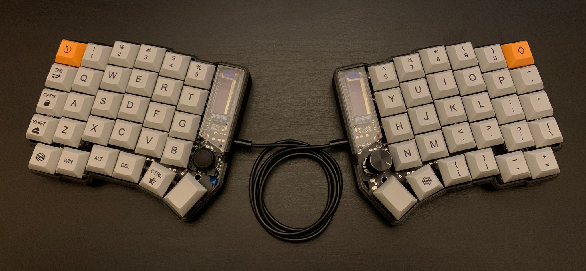
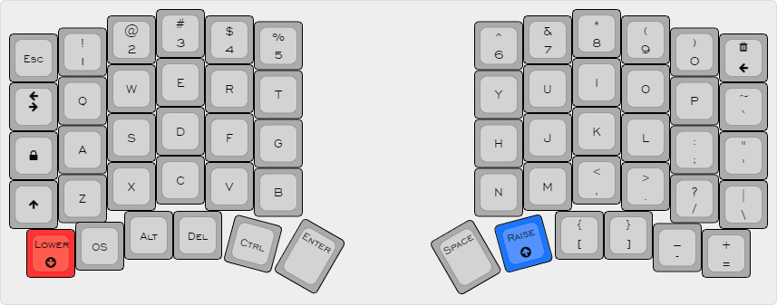
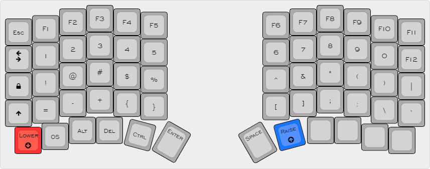
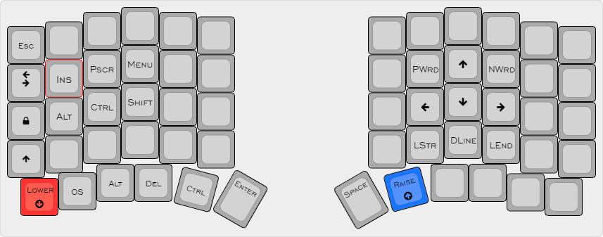
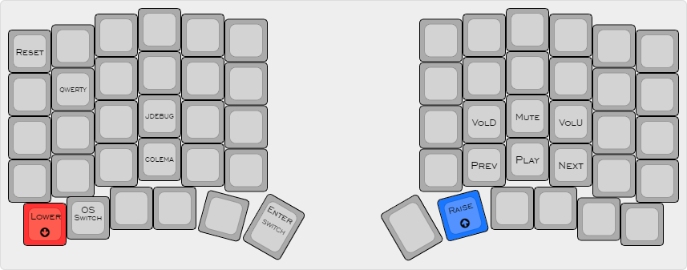
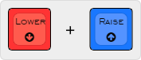

# Lime Keyboard

Lime is a 6×4+6 keys column-staggered split keyboard with encoder and joystick support. Based on [Lily58](https://github.com/kata0510/Lily58), [Corne](https://github.com/foostan/crkbd), [Helix](https://github.com/MakotoKurauchi/helix) and [Sofle](https://github.com/josefadamcik/SofleKeyboard) keyboards. This board features a reversible PCB, OLEDs, Underglow and Bluetooth support. The PCB has holes for floating or screwed mounts but can be also mounted with a gasket.

The Lime keyboard was created by [HellTM](https://github.com/HellSingCoder) with the help of the QMK and custom keyboard community.

**If you would like one of these contact me, I will probably run a couple batches in the future.**

## Firmware 

This keyboard runs [QMK](https://qmk.fm/) (no VIA support).

## Default layout 

### Base layer

The layout can be switched for COLEMAK in the settings layer

### Lower layer

### Raise layer

### Settings layer

This layer can be accessed with the following combination:

## Extras

### Keyboard Pet (Luna)

Luna jumps every time you hit Space and will bark at people on the internet if you activate Caps Lock!

This keyboard pet reacts to your WPM counter:
- under 10 -> sit
- between 10 and 50 -> walk
- over 50 -> run

### Shift + Backspace = Delete
This one is pretty self explanatory.

### Space / Enter swap
The Enter and Space functions can be swapped pressing the left thumb button from the Setting layer. The current mode will be displayed on the left display. This one may be useful to all the gamers out there!

### OS Switch
Pressing the OS button while on the settings layer will toggle the MAC / WIN mode. This corrects the behaviour of the Alt and Control modifiers. The current selection will be displayed with an icon at the top of the left display.

### Media Buttons
The right encoder controls the volume and can be pressed to mute. Extra media buttons are hidden away on the settings layer.

### RGB Underglow Support
The board features a 5 LEDs extensible or overridable underglow. Unfortunately, the default keymap does not take advantage of that because of the very limited space but, the option is out there if you want to play around with it.

### WPM indicator
Current WPM will be displayed at the bottom of the right screen.

### Joystick Debug
The JDebug button on the settings layer toggles the ADC readings of the joystick pins for X and Y axis. These will be displayed on the left OLED.

## Special thanks

[Envious](https://github.com/Envious-Data) - Kicad sage

[Dasky](https://github.com/daskygit) - Joystick Troubleshooting guru